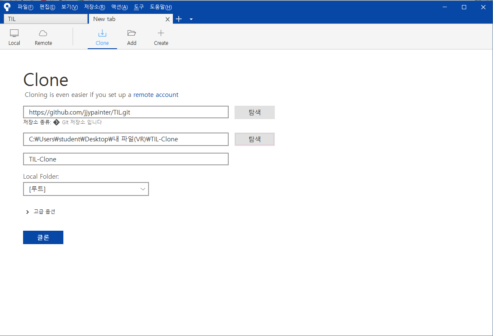

# Git중급

컬티캠퍼스 강의장안에 있는 git들을 집에서까지 보고 수정할 수 있게 하는 방법에 대해 공부. 밑에는 그 순서

## Clone

Github로 가서 다운로드를 할수도 있으나 다운로드는 '.git'파일이 나오지 않기 때문에(정확히는, 카메라가 빠진상황) 반드시 Cloning을 해주어야 한다. 

소스트리에서 새로운 탭을 눌러 반드시, 클로닝을 해줄것!

그리고 그뒤에는, 당연히 Push.

## Pull

집에 가면 작업을 해야 하는데, 그것을 하려면, 자료를 내려받아야 된다. 이때 필요한 것이 Pull이다. Push왼쪽에 우치하고 있기 때문에, 그냥 누르면 된다. 누르고 나서 자료가 무사히 나왔는지 확인해보자.

## 기타

집외에도, 집에서 멀캠 컴으로 갈때도 해당내용은 비슷하게 반복된다.